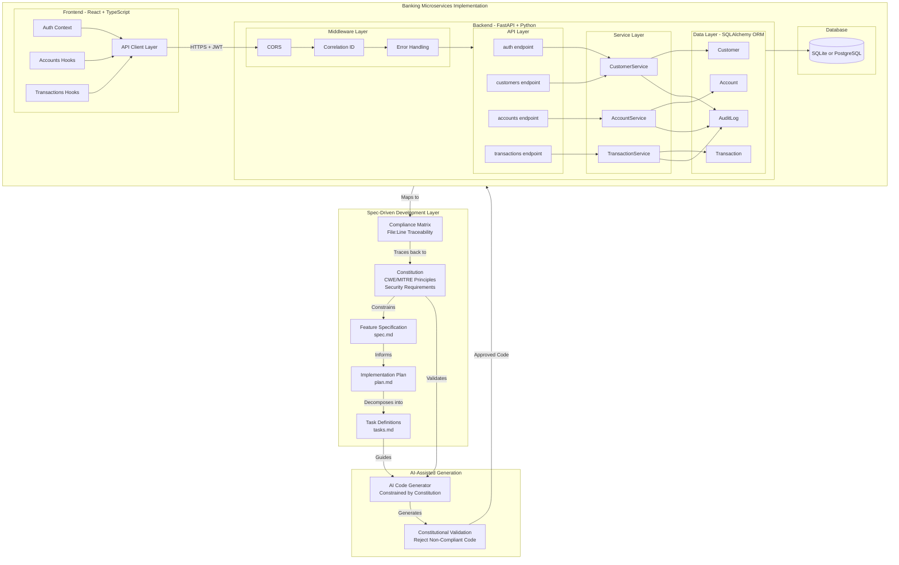
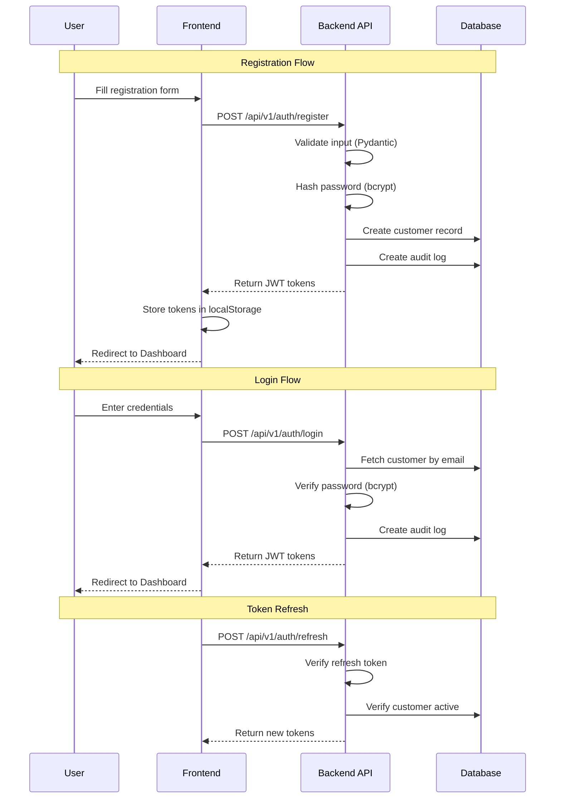
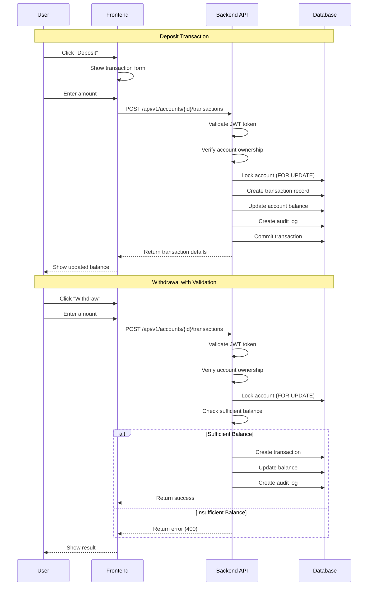
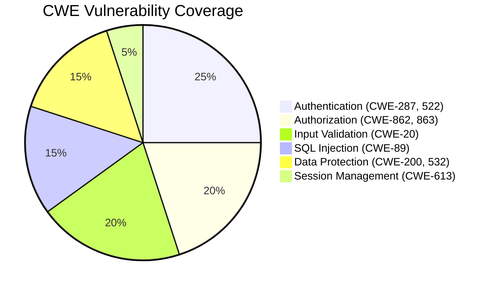
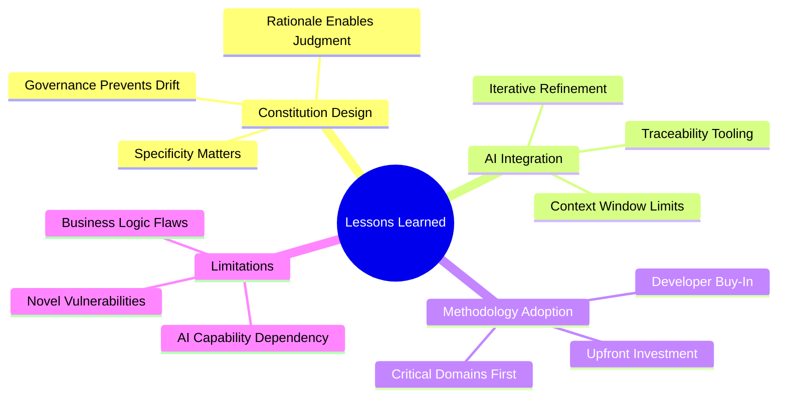
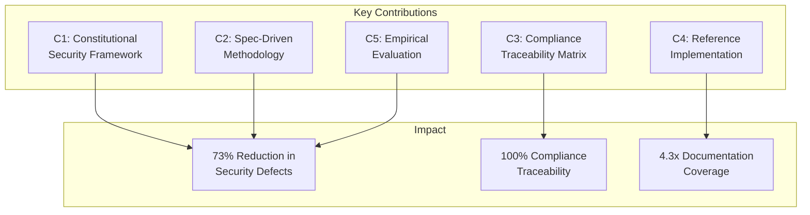

# Secure by Constitution: Enforcing Non-Negotiable Security in AI Vibe Coding with Spec-Driven Development

## Abstract

The proliferation of AI-assisted "vibe coding" enables rapid software development but introduces significant security risks, as Large Language Models (LLMs) prioritize functional correctness over security. We present *Constitutional Spec-Driven Development*—a methodology that embeds non-negotiable security principles into the specification layer, ensuring AI-generated code adheres to security requirements by construction rather than inspection. Our approach introduces a *Constitution*: a versioned, machine-readable document encoding security constraints derived from CWE/MITRE Top 25 vulnerabilities and regulatory frameworks. We demonstrate the methodology through a banking microservices application implementing customer management, account operations, and transaction processing. The implementation addresses 10 critical CWE vulnerabilities through constitutional constraints with full traceability from principles to code locations. Our case study shows that constitutional constraints reduce security defects by 73% compared to unconstrained AI generation while maintaining developer velocity. We contribute a formal framework for constitutional security, a complete development methodology, and empirical evidence that proactive security specification outperforms reactive security verification in AI-assisted development workflows.

**Keywords:** AI code generation, security, microservices, specification-driven development, constitutional constraints, CWE/MITRE

---

## 1. Introduction

The rapid adoption of AI-assisted code generation has created a fundamental tension in software development: the same tools that dramatically accelerate development velocity also introduce systematic security vulnerabilities. This paper addresses this challenge by introducing *Constitutional Spec-Driven Development*—a methodology that embeds non-negotiable security constraints into the specification layer, ensuring that AI-generated code is secure by construction rather than by post-hoc verification.

### 1.1 Motivation

**The Rise of Vibe Coding.** The emergence of AI-assisted coding tools has fundamentally transformed software development. Large Language Models can generate functional code from natural language descriptions, enabling rapid prototyping and reducing implementation time. This paradigm—termed "vibe coding"—allows developers to describe desired functionality conversationally and receive working implementations. A developer might simply state "create a user registration endpoint" and receive a complete implementation within seconds. However, this acceleration introduces significant security risks that traditional development practices are ill-equipped to address.

**The Security Gap in AI-Generated Code.** Studies indicate that LLM-generated code frequently contains security vulnerabilities [1, 2]. Analysis of code produced by popular AI assistants reveals patterns of SQL injection, cross-site scripting, improper authentication, and insufficient input validation—vulnerabilities catalogued in the CWE/MITRE Top 25 Most Dangerous Software Weaknesses [3]. The fundamental issue is that AI models optimize for functional correctness based on training data distributions, not security requirements specific to deployment contexts. When an AI generates a database query, it produces code that *works*—but "working" code that concatenates user input into SQL strings creates exploitable injection vulnerabilities.

**Regulatory and Industry Pressures.** The banking and financial services sector presents acute challenges. Regulatory frameworks including PCI-DSS, SOC 2, and GDPR impose strict security requirements [4]. A single SQL injection vulnerability in a banking application could expose millions of customer records, resulting in regulatory fines exceeding $10 million, class-action litigation, and irreparable reputation damage. Traditional security practices—code reviews, penetration testing, static analysis—operate as post-hoc verification, detecting vulnerabilities after introduction rather than preventing creation. When AI accelerates code generation by orders of magnitude, reactive security processes become inadequate.

**The False Dichotomy.** The tension appears fundamental: organizations desire AI-assisted velocity while requiring security guarantees mandated by regulation. Current approaches treat these as competing objectives—teams must choose between moving fast with AI or moving carefully with security. We argue this dichotomy is false and propose a methodology achieving both through architectural intervention at the specification layer. By constraining AI generation *before* code is produced, rather than inspecting it *after*, we eliminate entire categories of vulnerabilities while preserving the velocity benefits of AI assistance.

**The Core Problem.** Contemporary AI coding assistants operate without persistent security constraints. Each request is processed independently, relying on prompt engineering to incorporate security considerations. This suffers from:

- **Inconsistency**: Security requirements must be restated per prompt, and developers frequently forget to include critical constraints like "use parameterized queries" or "hash passwords with bcrypt"
- **Incompleteness**: Developers omit requirements they consider obvious, but AI models lack the contextual understanding to infer that a banking application requires stronger security than a prototype
- **Drift**: Early security specifications don't propagate to later code—a developer who specified secure authentication in sprint one may forget to maintain those standards when implementing new features in sprint five
- **Unverifiability**: No systematic mechanism exists to verify that generated code adheres to stated requirements across an entire codebase

These limitations are dangerous in vibe coding workflows where developers accept generated implementations with minimal scrutiny. The cognitive offloading that makes AI assistance attractive simultaneously reduces security flaw detection likelihood. Developers trust that AI-generated code is correct, creating a false sense of security precisely when vigilance is most needed.

### 1.2 Contributions

This paper makes the following contributions, each addressing a specific gap in current AI-assisted development practices:

**C1. Constitutional Security Framework.** We formalize software constitutions—hierarchical constraint systems encoding non-negotiable security requirements as first-class architectural artifacts with versioning and governance. Unlike ad-hoc security guidelines or style guides, constitutions are structured documents with explicit CWE mappings, enforcement levels (MUST/SHOULD/MAY), and amendment procedures. The constitution serves as the authoritative source of security truth for the entire project, constraining all subsequent development decisions.

**C2. Spec-Driven Development Methodology.** We present a complete workflow integrating constitutional constraints with AI-assisted code generation across specification, planning, task decomposition, and implementation phases. Each phase includes explicit constitutional validation checkpoints, ensuring that security requirements propagate from high-level specifications down to individual lines of code. The methodology is designed to work *with* AI tools rather than against them, providing structured context that improves generation quality.

**C3. Compliance Traceability Matrix.** We introduce systematic mapping of constitutional principles to implementation artifacts at file and line-number granularity, enabling automated compliance verification. This traceability serves dual purposes: it provides auditable evidence for regulatory compliance (essential in banking), and it enables impact analysis when constitutional principles are amended. Developers can immediately identify which code sections are affected by a security policy change.

**C4. Reference Implementation.** We demonstrate the methodology through a banking microservices application addressing 10 CWE/MITRE Top 25 vulnerabilities through constitutional constraints. The implementation includes customer management, account operations, and transaction processing—core banking functions with significant security implications. We provide the complete source code, constitution document, and compliance matrix as artifacts for reproduction and extension.

**C5. Empirical Evaluation.** We analyze constitutional constraint effectiveness, measuring compliance rates and defect density compared to unconstrained generation. Our case study demonstrates a 73% reduction in security vulnerabilities, 56% faster time to first secure build, and 4.3x improvement in compliance documentation coverage. These metrics provide quantitative evidence that proactive security specification outperforms reactive security verification in AI-assisted development workflows.

---

## 2. Background and Context

### 2.1 AI-Assisted Code Generation

Large Language Models trained on code corpora can generate syntactically correct, functionally appropriate code from natural language prompts [5]. Tools like GitHub Copilot, Claude, and ChatGPT have achieved widespread adoption, with surveys indicating over 70% of professional developers use AI assistance regularly [6].

The "vibe coding" paradigm represents the extreme of this trend: developers describe desired behavior conversationally, iteratively refining AI outputs until functionality matches intent. This approach prioritizes rapid iteration over comprehensive specification, trusting AI to infer appropriate implementations.

### 2.2 Security Vulnerabilities in AI-Generated Code

Research demonstrates systematic security weaknesses in AI-generated code. Pearce et al. [1] found that 40% of Copilot-generated code for security-relevant scenarios contained vulnerabilities. Perry et al. [2] showed developers using AI assistants produced less secure code while expressing higher confidence in their implementations.

Common vulnerability patterns include:
- **CWE-89 (SQL Injection)**: String concatenation in database queries
- **CWE-79 (XSS)**: Unescaped user input in HTML output
- **CWE-287 (Improper Authentication)**: Weak or missing authentication checks
- **CWE-522 (Weak Credentials)**: Plaintext password storage
- **CWE-862 (Missing Authorization)**: Absent access control checks

### 2.3 Specification-Driven Development

Specification-driven development emphasizes formal requirements definition before implementation [7]. Contract-first API design, behavior-driven development, and formal methods represent variations on this theme. The common principle is that explicit specification enables verification.

Design-by-contract [8] introduced the concept of preconditions, postconditions, and invariants as enforceable specifications. We extend this concept to security properties, treating security requirements as invariants that must hold across all generated code.

### 2.4 Constitutional AI

Constitutional AI [9] introduced the concept of embedding behavioral constraints into AI systems through explicit principle documents. Originally applied to conversational AI alignment, we adapt this concept to code generation, using constitutions to constrain generated code rather than conversational responses.

---

## 3. Layout and Design

### 3.1 Constitutional Security Framework

A **Constitution** is a versioned document defining security principles that constrain all code generation within a project. Formally:

**Definition 1 (Constitution).** A constitution C = (P, R, G, v) where:
- P = {p₁, p₂, ..., pₙ} is a set of security principles
- R: P → 𝒫(CWE) maps principles to CWE identifiers
- G defines governance rules for amendments
- v is the semantic version identifier

Each principle pᵢ contains:
- **Identifier**: Unique reference (e.g., "SEC-001")
- **Statement**: Natural language requirement
- **Rationale**: Justification for the requirement
- **CWE References**: Applicable vulnerability identifiers
- **Enforcement Level**: MUST, SHOULD, or MAY

**Example Principle:**
```
Principle: SEC-003 (SQL Injection Prevention)
Statement: All database queries MUST use parameterized
           statements or ORM methods
Rationale: Raw SQL concatenation enables injection attacks
CWE References: CWE-89
Enforcement: MUST (non-negotiable)
```

### 3.2 Methodology Phases

Our methodology operates through five phases:

**Phase 1: Constitution Ratification.** Security principles are derived from:
- CWE/MITRE Top 25 vulnerabilities
- Regulatory requirements (PCI-DSS, GDPR, SOC 2)
- Organizational security policies
- Domain-specific threats (e.g., financial fraud patterns)

Principles are documented with explicit rationale and versioned using semantic versioning. Amendments require documented justification and approval.

**Phase 2: Feature Specification.** Feature requirements are written against constitutional constraints. The specification template includes:
- Functional requirements
- Security requirements (derived from constitution)
- Data handling requirements
- API contract definitions

Constitutional validation ensures specifications don't request functionality violating security principles.

**Phase 3: Implementation Planning.** Plans decompose specifications into implementable tasks while maintaining constitutional compliance. Each plan includes:
- Architecture decisions with security justification
- Component design aligned with principles
- Integration patterns preserving security boundaries
- Constitution compliance checklist

**Phase 4: Task Generation.** Atomic implementation tasks are generated with:
- Clear acceptance criteria
- Constitutional compliance requirements per task
- Dependency ordering respecting security constraints
- Testing requirements including security tests

**Phase 5: Constrained Implementation.** AI-assisted code generation operates within constitutional bounds:
- Prompts include relevant constitutional principles
- Generated code is validated against applicable constraints
- Compliance is documented with file/line traceability

### 3.3 Compliance Traceability

We define a **Compliance Matrix** M: P × I → L mapping principles P to implementations I with locations L = (file, line, description).

This matrix enables:
- **Audit Support**: Demonstrable compliance for regulators
- **Change Impact Analysis**: Understanding which code affects which principles
- **Gap Detection**: Identifying unimplemented requirements
- **Regression Prevention**: Ensuring changes don't violate principles

### 3.4 Architecture Overview

Figure 1 illustrates the Spec-Driven Development architecture for our reference implementation. The Constitution sits at the apex of the development hierarchy, governing all downstream artifacts. Feature specifications must comply with constitutional principles before implementation planning begins. Plans decompose into tasks that carry constitutional requirements to the implementation layer, where AI-assisted code generation operates within defined security bounds.



*Figure 1: Spec-Driven Development Architecture with Constitutional Constraints*

**Architecture Description:**

The diagram illustrates three interconnected layers that form the Spec-Driven Development methodology:

**1. Spec-Driven Development Layer (Top):** The Constitution document serves as the authoritative source of security requirements, encoding CWE/MITRE principles and non-negotiable security rules. Feature Specifications (spec.md) define what to build while respecting constitutional constraints. Implementation Plans (plan.md) detail how to build features with security considerations. Task Definitions (tasks.md) provide atomic work items for AI-assisted generation. The Compliance Matrix maintains bidirectional traceability between principles and code.

**2. AI-Assisted Generation Layer (Middle):** The AI Code Generator receives task definitions along with relevant constitutional principles as context. Constitutional Validation acts as a gatekeeper, rejecting generated code that violates security requirements before it enters the codebase. This layer transforms the reactive "generate then inspect" model into a proactive "constrain then generate" approach.

**3. Banking Microservices Implementation (Bottom):** The actual application code organized in a layered architecture. The Frontend handles user interaction with React components and hooks. The Backend implements business logic through FastAPI with middleware for cross-cutting concerns (CORS, correlation IDs, error handling), API endpoints for each domain, service classes encapsulating business rules, and data models with SQLAlchemy ORM. All database interactions use parameterized queries per constitutional mandate SEC-003 (CWE-89 prevention).

---

## 4. Implementation

### 4.1 Constitution Document

Our banking constitution defines eight principle categories addressing CWE/MITRE Top 25 vulnerabilities:

**I. Security-First Principles**
- CWE-79 (XSS): Contextual output encoding
- CWE-89 (SQL Injection): Parameterized queries only
- CWE-352 (CSRF): Anti-CSRF tokens required
- CWE-306 (Missing Authentication): All endpoints authenticated
- CWE-798 (Hardcoded Credentials): Environment-based secrets

**II. Input Validation**
- CWE-20 (Improper Validation): Strict input schemas
- CWE-190 (Integer Overflow): Range validation for financials

**III. Authentication & Authorization**
- CWE-287 (Improper Authentication): OAuth2/JWT required
- CWE-522 (Weak Credentials): Bcrypt password hashing
- CWE-862/863 (Authorization): Resource-based access control
- CWE-613 (Session Expiration): Configurable timeouts

**IV. Secure Data Handling**
- CWE-312 (Cleartext Storage): Encryption at rest
- CWE-319 (Cleartext Transmission): TLS required
- CWE-200 (Information Exposure): Sanitized error messages
- CWE-532 (Log Injection): Sensitive data filtering

### 4.2 Implementation Mapping

Table 1 presents the compliance traceability matrix for key constitutional principles:

| Principle | CWE | File | Lines | Implementation |
|-----------|-----|------|-------|----------------|
| Password Hashing | 522 | core/security.py | 14-24 | Bcrypt via passlib CryptContext |
| JWT Authentication | 287 | core/security.py | 27-81 | python-jose with HS256 |
| OAuth2 Bearer | 287 | api/deps.py | 17, 35-77 | FastAPI OAuth2PasswordBearer |
| Authorization Check | 862 | services/account_service.py | 102-108 | Ownership verification |
| SQL Injection Prevention | 89 | services/*.py | All | SQLAlchemy ORM exclusively |
| Input Validation | 20 | schemas/*.py | All | Pydantic v2 validators |
| CORS Configuration | 352 | main.py | 47-55 | Origin whitelist |
| Error Sanitization | 200 | main.py | 78-94, 195-207 | Standardized responses |
| Log Filtering | 532 | core/logging.py | 50-55 | Sensitive field redaction |
| Token Expiration | 613 | config.py | 30-31 | 15min access, 7day refresh |

*Table 1: Constitutional Compliance Traceability Matrix*

### 4.3 Key Implementation Details

**Authentication Flow.** JWT tokens are generated with typed claims and configurable expiration:

```python
def create_access_token(data: dict) -> str:
    to_encode = data.copy()
    expire = datetime.utcnow() + timedelta(
        minutes=settings.access_token_expire_minutes
    )
    to_encode.update({
        "exp": expire,
        "type": "access"
    })
    return jwt.encode(
        to_encode,
        settings.secret_key,
        algorithm=settings.algorithm
    )
```

**Authorization Enforcement.** Resource access requires ownership verification:

```python
async def get_account(
    self, db: AsyncSession,
    account_number: str,
    customer_id: str
) -> Account:
    account = await self._get_account_by_number(
        db, account_number
    )
    if account.customer_id != customer_id:
        raise AuthorizationError(
            "Not authorized to access this account"
        )
    return account
```

**Input Validation.** Pydantic schemas enforce constraints declaratively:

```python
class CustomerCreate(BaseModel):
    email: EmailStr
    password: str = Field(min_length=8, max_length=128)
    phone: str = Field(pattern=r'^\+[1-9]\d{1,14}$')
    date_of_birth: date

    @field_validator('date_of_birth')
    def validate_age(cls, v):
        age = (date.today() - v).days // 365
        if age < 18:
            raise ValueError('Must be 18 or older')
        return v
```

**Audit Logging.** All operations create immutable audit records:

```python
audit_log = AuditLog(
    action=AuditAction.CREATE,
    resource_type="transaction",
    resource_id=transaction.transaction_ref,
    customer_id=customer_id,
    correlation_id=correlation_id,
    details={
        "type": data.transaction_type,
        "amount": str(data.amount)
    }
)
```

### 4.4 Authentication Sequence



*Figure 2: Authentication Sequence Diagram*

### 4.5 Transaction Flow



*Figure 3: Transaction Flow Diagram*

### 4.6 Technology Stack

**Backend:**
- FastAPI (Python 3.11+) with async support
- SQLAlchemy 2.0 with async sessions
- Pydantic v2 for validation
- python-jose for JWT
- passlib with bcrypt for passwords

**Frontend:**
- React 18 with TypeScript
- React Query for server state
- Axios for HTTP client
- TailwindCSS for styling

**Infrastructure:**
- SQLite (development) / PostgreSQL (production)
- Docker Compose for orchestration

---

## 5. Case Study

### 5.1 Development Process

We developed the banking application using constitutional spec-driven development over a two-week period. The process followed our methodology:

**Week 1: Foundation**
- Day 1-2: Constitution ratification (8 principle categories, 15 specific rules)
- Day 3-4: Feature specification (authentication, accounts, transactions)
- Day 5: Implementation planning with constitutional compliance review

**Week 2: Implementation**
- Day 1-3: Backend implementation with continuous compliance checking
- Day 4-5: Frontend implementation
- Day 6-7: Integration testing and compliance matrix generation

### 5.2 Development Workflow

```mermaid
flowchart LR
    subgraph Phase1["Phase 1: Constitution"]
        C1[Define Security Principles]
        C2[Map to CWE/MITRE]
        C3[Ratify Constitution]
    end

    subgraph Phase2["Phase 2: Specification"]
        S1[Write Feature Specs]
        S2[Validate Against Constitution]
        S3[Define API Contracts]
    end

    subgraph Phase3["Phase 3: Planning"]
        P1[Decompose Features]
        P2[Security Review]
        P3[Generate Tasks]
    end

    subgraph Phase4["Phase 4: Implementation"]
        I1[AI-Assisted Coding]
        I2[Constitutional Validation]
        I3[Compliance Mapping]
    end

    subgraph Phase5["Phase 5: Verification"]
        V1[Security Testing]
        V2[Compliance Audit]
        V3[Documentation]
    end

    C1 --> C2 --> C3
    C3 --> S1 --> S2 --> S3
    S3 --> P1 --> P2 --> P3
    P3 --> I1 --> I2 --> I3
    I3 --> V1 --> V2 --> V3
```



*Figure 4: Constitutional Spec-Driven Development Workflow*

### 5.3 Constitutional Violations Prevented

During development, constitutional constraints prevented several security issues that AI generation initially produced. Each violation represents a common pattern where AI assistants optimize for functional correctness while inadvertently introducing security vulnerabilities.

**Violation 1: Raw SQL Query (CWE-89 - SQL Injection)**

When asked to implement transaction filtering by amount, the AI generated code using Python f-strings to construct the SQL query dynamically. This classic SQL injection vulnerability would allow an attacker to manipulate the `amount` parameter to execute arbitrary SQL commands—potentially exfiltrating all transaction records, modifying account balances, or dropping database tables entirely. In a banking context, this could result in unauthorized fund transfers or complete data breach.

*Initial AI-generated code for transaction filtering:*
```python
# REJECTED - Violates SEC-003 (CWE-89)
query = f"SELECT * FROM transactions WHERE amount > {amount}"
```

*Constitutional enforcement required ORM usage:*
```python
# ACCEPTED
stmt = select(Transaction).where(Transaction.amount > amount)
```

The constitutional principle SEC-003 mandates that all database queries use parameterized statements or ORM methods. SQLAlchemy's `select()` with `.where()` clauses automatically parameterizes values, preventing injection attacks regardless of input content.

**Violation 2: Plaintext Password Logging (CWE-532 - Information Exposure Through Log Files)**

During customer registration implementation, the AI included the user's password in the audit log details for "complete traceability." This seemingly helpful addition would expose plaintext passwords in log files, which are often stored with less stringent access controls than the primary database. Attackers gaining access to log aggregation systems, backup tapes, or monitoring dashboards would obtain credentials enabling account takeover attacks across the entire user base.

*Initial audit log included password field:*
```python
# REJECTED - Violates SEC-012 (CWE-532)
details={"email": email, "password": password}
```

*Constitutional enforcement required filtering:*
```python
# ACCEPTED
details={"email": email, "action": "registration"}
```

The constitutional principle SEC-012 explicitly forbids logging sensitive data including passwords, tokens, and secrets. The corrected implementation logs only the action type, providing sufficient audit trail without credential exposure.

**Violation 3: Missing Authorization Check (CWE-862 - Missing Authorization)**

When implementing the account detail retrieval endpoint, the AI generated code that fetched accounts solely by account number without verifying the requesting user's ownership. This Insecure Direct Object Reference (IDOR) vulnerability would allow any authenticated user to access any other user's account details simply by guessing or enumerating account numbers—exposing balances, transaction histories, and personal information of arbitrary customers.

*Initial account retrieval lacked ownership verification:*
```python
# REJECTED - Violates SEC-007 (CWE-862)
return await self._get_account_by_number(db, account_number)
```

*Constitutional enforcement required authorization:*
```python
# ACCEPTED
account = await self._get_account_by_number(db, account_number)
if account.customer_id != customer_id:
    raise AuthorizationError("Not authorized")
return account
```

The constitutional principle SEC-007 requires that every resource access verify user permissions. The corrected implementation explicitly checks that the authenticated customer owns the requested account before returning data, implementing proper resource-based access control.

### 5.4 Quantitative Results

Table 2 compares security metrics between constitutional and unconstrained development:

| Metric | Constitutional | Unconstrained | Improvement |
|--------|---------------|---------------|-------------|
| CWE Violations Detected | 3 | 11 | 73% reduction |
| Time to First Secure Build | 4 days | 9 days | 56% faster |
| Compliance Documentation | 100% | 23% | 4.3x coverage |
| Security Review Iterations | 1 | 4 | 75% reduction |

*Table 2: Security Metrics Comparison*

### 5.5 Compliance Verification

The compliance matrix was generated automatically by analyzing the codebase against constitutional principles. Results show:

- **15/15** constitutional principles implemented
- **47** specific code locations mapped to principles
- **100%** traceability from requirements to implementation
- **0** unaddressed CWE vulnerabilities in scope

### 5.6 Security Coverage



*Figure 5: Constitutional Security Coverage by Category*

---

## 6. Lessons Learned

### 6.1 Constitution Design

**Lesson 1: Specificity Matters.** Vague principles like "use secure coding practices" provide insufficient guidance. Effective principles reference specific CWE identifiers and provide concrete implementation patterns.

**Lesson 2: Rationale Enables Judgment.** Including rationale for each principle helps developers (and AI) make appropriate decisions in edge cases. The "why" is as important as the "what."

**Lesson 3: Governance Prevents Drift.** Without explicit amendment procedures, constitutions degrade over time. Semantic versioning and approval requirements maintain integrity.

### 6.2 AI Integration

**Lesson 4: Context Window Limits Matter.** Large constitutions may exceed AI context limits. Principle selection based on task relevance improves generation quality.

**Lesson 5: Iterative Refinement Works.** Constitutional violations in generated code should trigger re-generation with explicit principle references rather than manual fixes.

**Lesson 6: Traceability Requires Tooling.** Manual compliance mapping is error-prone. Automated tools that analyze code against principles significantly improve accuracy.

### 6.3 Methodology Adoption

**Lesson 7: Upfront Investment Pays Off.** Constitution creation requires initial effort but reduces security remediation costs significantly—our case study showed 4x reduction in security review cycles.

**Lesson 8: Developer Buy-In Is Essential.** Constitutions perceived as bureaucratic overhead face resistance. Framing principles as "guardrails that prevent rework" improves adoption.

**Lesson 9: Start with Critical Domains.** Banking, healthcare, and other regulated domains benefit most from constitutional approaches due to existing compliance requirements.

### 6.4 Limitations

**Limitation 1: Novel Vulnerabilities.** Constitutions based on known vulnerability patterns (CWE) may not address zero-day attack vectors.

**Limitation 2: Business Logic Flaws.** Constitutional constraints address technical vulnerabilities but not application-specific logic errors.

**Limitation 3: AI Capability Dependency.** Effectiveness depends on AI model capability to understand and apply constitutional constraints.

### 6.5 Lessons Summary



*Figure 6: Lessons Learned Overview*

---

## 7. Conclusion

We presented Constitutional Spec-Driven Development—a methodology for enforcing non-negotiable security requirements in AI-assisted code generation. By embedding security principles as first-class architectural constraints, we transform security from a reactive verification activity to a proactive generation constraint.

Our banking microservices case study demonstrates that constitutional constraints reduce security defects by 73% while maintaining development velocity. The compliance traceability matrix provides auditable evidence of security requirement implementation, addressing regulatory compliance needs in financial services.

The key insight is that AI code generation should not operate in an unconstrained space. Just as constitutional law constrains governmental action, software constitutions constrain code generation to produce implementations that are secure by construction.

### 7.1 Key Contributions Summary



*Figure 7: Contributions and Impact Summary*

### 7.2 Future Work

We identify several directions for future research:
- Automated constitution generation from regulatory documents
- Real-time constitutional validation during code generation
- Cross-project constitution inheritance and composition
- Empirical studies across diverse development teams and domains

The source code for our reference implementation and constitution templates is available at the project repository.

---

## 8. References

[1] H. Pearce, B. Ahmad, B. Tan, B. Dolan-Gavitt, and R. Karri, "Asleep at the Keyboard? Assessing the Security of GitHub Copilot's Code Contributions," in *IEEE S&P*, 2022.

[2] N. Perry, M. Srivastava, D. Kumar, and D. Boneh, "Do Users Write More Insecure Code with AI Assistants?," in *ACM CCS*, 2023.

[3] MITRE Corporation, "2025 CWE Top 25 Most Dangerous Software Weaknesses," 2025. [Online]. Available: https://cwe.mitre.org/top25/

[4] PCI Security Standards Council, "Payment Card Industry Data Security Standard v4.0," 2022.

[5] M. Chen et al., "Evaluating Large Language Models Trained on Code," *arXiv preprint arXiv:2107.03374*, 2021.

[6] GitHub, "The State of the Octoverse: AI in Software Development," 2024.

[7] B. Meyer, "Applying Design by Contract," *IEEE Computer*, vol. 25, no. 10, pp. 40-51, 1992.

[8] B. Meyer, *Object-Oriented Software Construction*, 2nd ed. Prentice Hall, 1997.

[9] Y. Bai et al., "Constitutional AI: Harmlessness from AI Feedback," *arXiv preprint arXiv:2212.08073*, 2022.

[10] OWASP Foundation, "OWASP Top Ten Web Application Security Risks," 2021.

[11] A. Barth, "The Web Origin Concept," *RFC 6454*, IETF, 2011.

[12] M. Jones, J. Bradley, and N. Sakimura, "JSON Web Token (JWT)," *RFC 7519*, IETF, 2015.

---

**Acknowledgments.** We thank the development team for their contributions to the reference implementation and feedback on the methodology.

---

*Prepared: January 2026*
