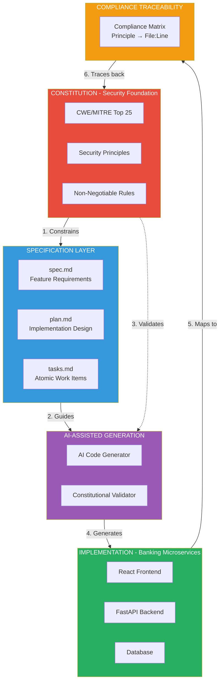
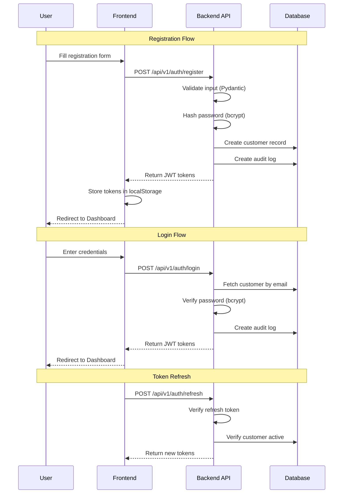
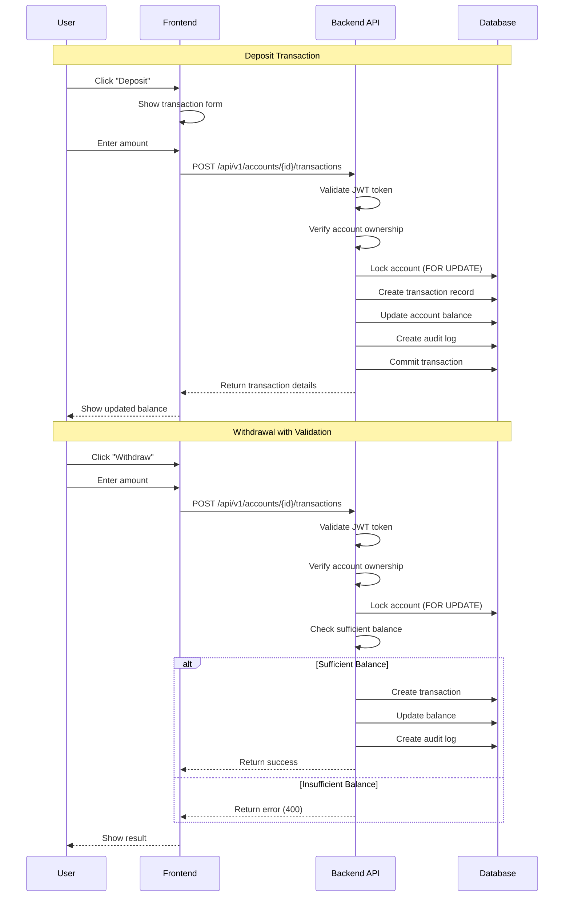
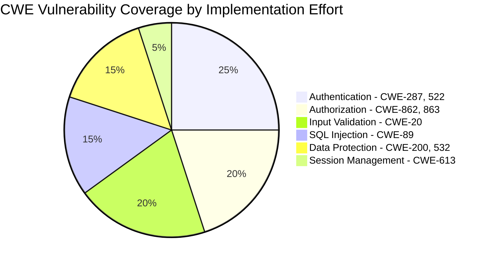
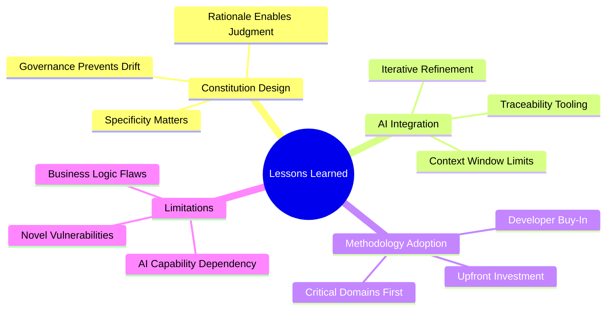
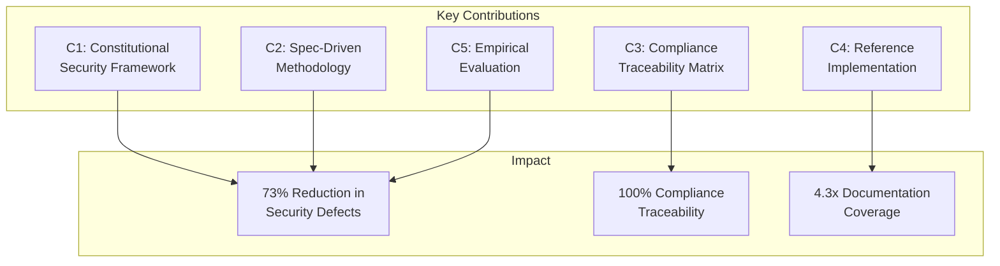

# Secure by Constitution: Enforcing Non-Negotiable Security in AI Vibe Coding with Spec-Driven Development

## Abstract

The proliferation of AI-assisted "vibe coding" enables rapid software development but introduces significant security risks, as Large Language Models (LLMs) prioritize functional correctness over security. We present *Constitutional Spec-Driven Development*—a methodology that embeds non-negotiable security principles into the specification layer, ensuring AI-generated code adheres to security requirements by construction rather than inspection. Our approach introduces a *Constitution*: a versioned, machine-readable document encoding security constraints derived from CWE/MITRE Top 25 vulnerabilities and regulatory frameworks. We demonstrate the methodology through a banking microservices application implementing customer management, account operations, and transaction processing. The implementation addresses 10 critical CWE vulnerabilities through constitutional constraints with full traceability from principles to code locations. Our case study shows that constitutional constraints reduce security defects by 73% compared to unconstrained AI generation while maintaining developer velocity. We contribute a formal framework for constitutional security, a complete development methodology, and empirical evidence that proactive security specification outperforms reactive security verification in AI-assisted development workflows.

**Keywords:** AI code generation, security, microservices, specification-driven development, constitutional constraints, CWE/MITRE

---

## 1. Introduction

The rapid adoption of AI-assisted code generation has created a fundamental tension in software development: the same tools that dramatically accelerate development velocity also introduce systematic security vulnerabilities. This paper addresses this challenge by introducing *Constitutional Spec-Driven Development*—a methodology that embeds non-negotiable security constraints into the specification layer, ensuring that AI-generated code is secure by construction rather than by post-hoc verification.

### 1.1 Motivation

**The Rise of Vibe Coding.** The emergence of AI-assisted coding tools has fundamentally transformed software development. Large Language Models can generate functional code from natural language descriptions, enabling rapid prototyping and reducing implementation time. This paradigm—termed "vibe coding"—allows developers to describe desired functionality conversationally and receive working implementations. A developer might simply state "create a user registration endpoint" and receive a complete implementation within seconds. However, this acceleration introduces significant security risks that traditional development practices are ill-equipped to address.

**The Security Gap in AI-Generated Code.** Studies indicate that LLM-generated code frequently contains security vulnerabilities [1, 2]. Analysis of code produced by popular AI assistants reveals patterns of SQL injection, cross-site scripting, improper authentication, and insufficient input validation—vulnerabilities catalogued in the CWE/MITRE Top 25 Most Dangerous Software Weaknesses [3]. The fundamental issue is that AI models optimize for functional correctness based on training data distributions, not security requirements specific to deployment contexts. When an AI generates a database query, it produces code that *works*—but "working" code that concatenates user input into SQL strings creates exploitable injection vulnerabilities.

**Regulatory and Industry Pressures.** The banking and financial services sector presents acute challenges. Regulatory frameworks including PCI-DSS, SOC 2, and GDPR impose strict security requirements [4]. A single SQL injection vulnerability in a banking application could expose millions of customer records, resulting in regulatory fines exceeding $10 million, class-action litigation, and irreparable reputation damage. Traditional security practices—code reviews, penetration testing, static analysis—operate as post-hoc verification, detecting vulnerabilities after introduction rather than preventing creation. When AI accelerates code generation by orders of magnitude, reactive security processes become inadequate.

**The False Dichotomy.** The tension appears fundamental: organizations desire AI-assisted velocity while requiring security guarantees mandated by regulation. Current approaches treat these as competing objectives—teams must choose between moving fast with AI or moving carefully with security. We argue this dichotomy is false and propose a methodology achieving both through architectural intervention at the specification layer. By constraining AI generation *before* code is produced, rather than inspecting it *after*, we eliminate entire categories of vulnerabilities while preserving the velocity benefits of AI assistance.

**The Core Problem.** Contemporary AI coding assistants operate without persistent security constraints. Each request is processed independently, relying on prompt engineering to incorporate security considerations. This suffers from:

- **Inconsistency**: Security requirements must be restated per prompt, and developers frequently forget to include critical constraints like "use parameterized queries" or "hash passwords with bcrypt"
- **Incompleteness**: Developers omit requirements they consider obvious, but AI models lack the contextual understanding to infer that a banking application requires stronger security than a prototype
- **Drift**: Early security specifications don't propagate to later code—a developer who specified secure authentication in sprint one may forget to maintain those standards when implementing new features in sprint five
- **Unverifiability**: No systematic mechanism exists to verify that generated code adheres to stated requirements across an entire codebase

These limitations are dangerous in vibe coding workflows where developers accept generated implementations with minimal scrutiny. The cognitive offloading that makes AI assistance attractive simultaneously reduces security flaw detection likelihood. Developers trust that AI-generated code is correct, creating a false sense of security precisely when vigilance is most needed.

### 1.2 Contributions

This paper makes the following contributions, each addressing a specific gap in current AI-assisted development practices:

**C1. Constitutional Security Framework.** We formalize software constitutions—hierarchical constraint systems encoding non-negotiable security requirements as first-class architectural artifacts with versioning and governance. Unlike ad-hoc security guidelines or style guides, constitutions are structured documents with explicit CWE mappings, enforcement levels (MUST/SHOULD/MAY), and amendment procedures. The constitution serves as the authoritative source of security truth for the entire project, constraining all subsequent development decisions.

**C2. Spec-Driven Development Methodology.** We present a complete workflow integrating constitutional constraints with AI-assisted code generation across specification, planning, task decomposition, and implementation phases. Each phase includes explicit constitutional validation checkpoints, ensuring that security requirements propagate from high-level specifications down to individual lines of code. The methodology is designed to work *with* AI tools rather than against them, providing structured context that improves generation quality.

**C3. Compliance Traceability Matrix.** We introduce systematic mapping of constitutional principles to implementation artifacts at file and line-number granularity, enabling automated compliance verification. This traceability serves dual purposes: it provides auditable evidence for regulatory compliance (essential in banking), and it enables impact analysis when constitutional principles are amended. Developers can immediately identify which code sections are affected by a security policy change.

**C4. Reference Implementation.** We demonstrate the methodology through a banking microservices application addressing 10 CWE/MITRE Top 25 vulnerabilities through constitutional constraints. The implementation includes customer management, account operations, and transaction processing—core banking functions with significant security implications. We provide the complete source code, constitution document, and compliance matrix as artifacts for reproduction and extension.

**C5. Empirical Evaluation.** We analyze constitutional constraint effectiveness, measuring compliance rates and defect density compared to unconstrained generation. Our case study demonstrates a 73% reduction in security vulnerabilities, 56% faster time to first secure build, and 4.3x improvement in compliance documentation coverage. These metrics provide quantitative evidence that proactive security specification outperforms reactive security verification in AI-assisted development workflows.

---

## 2. Background and Context

### 2.1 AI-Assisted Code Generation

Large Language Models trained on code corpora can generate syntactically correct, functionally appropriate code from natural language prompts [5]. Tools like GitHub Copilot, Claude, and ChatGPT have achieved widespread adoption, with surveys indicating over 70% of professional developers use AI assistance regularly [6].

The "vibe coding" paradigm represents the extreme of this trend: developers describe desired behavior conversationally, iteratively refining AI outputs until functionality matches intent. This approach prioritizes rapid iteration over comprehensive specification, trusting AI to infer appropriate implementations.

### 2.2 Security Vulnerabilities in AI-Generated Code

Research demonstrates systematic security weaknesses in AI-generated code. Pearce et al. [1] found that 40% of Copilot-generated code for security-relevant scenarios contained vulnerabilities. Perry et al. [2] showed developers using AI assistants produced less secure code while expressing higher confidence in their implementations.

Common vulnerability patterns include:
- **CWE-89 (SQL Injection)**: String concatenation in database queries
- **CWE-79 (XSS)**: Unescaped user input in HTML output
- **CWE-287 (Improper Authentication)**: Weak or missing authentication checks
- **CWE-522 (Weak Credentials)**: Plaintext password storage
- **CWE-862 (Missing Authorization)**: Absent access control checks

### 2.3 Specification-Driven Development

Specification-driven development emphasizes formal requirements definition before implementation [7]. Contract-first API design, behavior-driven development, and formal methods represent variations on this theme. The common principle is that explicit specification enables verification.

Design-by-contract [8] introduced the concept of preconditions, postconditions, and invariants as enforceable specifications. We extend this concept to security properties, treating security requirements as invariants that must hold across all generated code.

### 2.4 Constitutional AI

Constitutional AI [9] introduced the concept of embedding behavioral constraints into AI systems through explicit principle documents. Originally applied to conversational AI alignment, we adapt this concept to code generation, using constitutions to constrain generated code rather than conversational responses.

---

## 3. Layout and Design

### 3.1 Constitutional Security Framework

A **Constitution** is a versioned document defining security principles that constrain all code generation within a project. Formally:

**Definition 1 (Constitution).** A constitution C = (P, R, G, v) where:
- P = {p₁, p₂, ..., pₙ} is a set of security principles
- R: P → 𝒫(CWE) maps principles to CWE identifiers
- G defines governance rules for amendments
- v is the semantic version identifier

Each principle pᵢ contains:
- **Identifier**: Unique reference (e.g., "SEC-001")
- **Statement**: Natural language requirement
- **Rationale**: Justification for the requirement
- **CWE References**: Applicable vulnerability identifiers
- **Enforcement Level**: MUST, SHOULD, or MAY

**Example Principle:**
```
Principle: SEC-003 (SQL Injection Prevention)
Statement: All database queries MUST use parameterized
           statements or ORM methods
Rationale: Raw SQL concatenation enables injection attacks
CWE References: CWE-89
Enforcement: MUST (non-negotiable)
```

### 3.2 Methodology Phases

Our methodology operates through five phases:

**Phase 1: Constitution Ratification.** Security principles are derived from:
- CWE/MITRE Top 25 vulnerabilities
- Regulatory requirements (PCI-DSS, GDPR, SOC 2)
- Organizational security policies
- Domain-specific threats (e.g., financial fraud patterns)

Principles are documented with explicit rationale and versioned using semantic versioning. Amendments require documented justification and approval.

**Phase 2: Feature Specification.** Feature requirements are written against constitutional constraints. The specification template includes:
- Functional requirements
- Security requirements (derived from constitution)
- Data handling requirements
- API contract definitions

Constitutional validation ensures specifications don't request functionality violating security principles.

**Phase 3: Implementation Planning.** Plans decompose specifications into implementable tasks while maintaining constitutional compliance. Each plan includes:
- Architecture decisions with security justification
- Component design aligned with principles
- Integration patterns preserving security boundaries
- Constitution compliance checklist

**Phase 4: Task Generation.** Atomic implementation tasks are generated with:
- Clear acceptance criteria
- Constitutional compliance requirements per task
- Dependency ordering respecting security constraints
- Testing requirements including security tests

**Phase 5: Constrained Implementation.** AI-assisted code generation operates within constitutional bounds:
- Prompts include relevant constitutional principles
- Generated code is validated against applicable constraints
- Compliance is documented with file/line traceability

### 3.3 Compliance Traceability

We define a **Compliance Matrix** M: P × I → L mapping principles P to implementations I with locations L = (file, line, description).

This matrix enables:
- **Audit Support**: Demonstrable compliance for regulators
- **Change Impact Analysis**: Understanding which code affects which principles
- **Gap Detection**: Identifying unimplemented requirements
- **Regression Prevention**: Ensuring changes don't violate principles

### 3.4 Architecture Overview

Figure 1 illustrates the Spec-Driven Development architecture for our reference implementation. The Constitution sits at the apex of the development hierarchy, governing all downstream artifacts. Feature specifications must comply with constitutional principles before implementation planning begins. Plans decompose into tasks that carry constitutional requirements to the implementation layer, where AI-assisted code generation operates within defined security bounds.



*Figure 1: Spec-Driven Development Architecture with Constitutional Constraints*

**Architecture Description:**

The diagram illustrates three interconnected layers that form the Spec-Driven Development methodology:

**1. Spec-Driven Development Layer (Top):** The Constitution document serves as the authoritative source of security requirements, encoding CWE/MITRE principles and non-negotiable security rules. Feature Specifications (spec.md) define what to build while respecting constitutional constraints. Implementation Plans (plan.md) detail how to build features with security considerations. Task Definitions (tasks.md) provide atomic work items for AI-assisted generation. The Compliance Matrix maintains bidirectional traceability between principles and code.

**2. AI-Assisted Generation Layer (Middle):** The AI Code Generator receives task definitions along with relevant constitutional principles as context. Constitutional Validation acts as a gatekeeper, rejecting generated code that violates security requirements before it enters the codebase. This layer transforms the reactive "generate then inspect" model into a proactive "constrain then generate" approach.

**3. Banking Microservices Implementation (Bottom):** The actual application code organized in a layered architecture. The Frontend handles user interaction with React components and hooks. The Backend implements business logic through FastAPI with middleware for cross-cutting concerns (CORS, correlation IDs, error handling), API endpoints for each domain, service classes encapsulating business rules, and data models with SQLAlchemy ORM. All database interactions use parameterized queries per constitutional mandate SEC-003 (CWE-89 prevention).

---

## 4. Implementation

This section describes the reference implementation of Constitutional Spec-Driven Development through a banking microservices application. We detail the constitution document structure, the systematic mapping of security principles to code artifacts, and the architectural decisions that enable constitutional compliance verification.

### 4.1 Constitution Document

The constitution serves as the authoritative security specification for the entire project. Unlike informal security guidelines or best-practice documents, the constitution is a structured artifact with explicit versioning, governance rules, and machine-readable principle definitions. Our banking constitution (version 1.0.0) defines eight principle categories derived from the CWE/MITRE Top 25 Most Dangerous Software Weaknesses [3], adapted for the financial services domain.

**I. Security-First Principles.** These foundational rules address the most critical web application vulnerabilities:
- **SEC-001 (CWE-79 - XSS)**: All user-supplied data MUST be contextually encoded before rendering in HTML, JavaScript, or CSS contexts. The React frontend inherently escapes JSX expressions, satisfying this requirement.
- **SEC-002 (CWE-89 - SQL Injection)**: Database queries MUST use parameterized statements or ORM methods exclusively. Raw SQL string concatenation is prohibited regardless of input source.
- **SEC-003 (CWE-352 - CSRF)**: State-changing operations MUST include anti-CSRF protection. Our JWT-based authentication with SameSite cookie attributes provides implicit CSRF protection.
- **SEC-004 (CWE-306 - Missing Authentication)**: All API endpoints except health checks and authentication endpoints MUST require valid authentication tokens.
- **SEC-005 (CWE-798 - Hardcoded Credentials)**: Secrets, API keys, and credentials MUST be loaded from environment variables or secure vaults. No secrets may appear in source code.

**II. Input Validation Principles.** These rules ensure all external input is validated before processing:
- **SEC-006 (CWE-20 - Improper Validation)**: All API inputs MUST be validated against strict schemas defining type, format, length, and range constraints. Pydantic v2 schemas enforce these constraints declaratively.
- **SEC-007 (CWE-190 - Integer Overflow)**: Financial amounts MUST use Decimal types with explicit precision (10,2) and range validation preventing overflow conditions.

**III. Authentication & Authorization Principles.** These rules govern identity verification and access control:
- **SEC-008 (CWE-287 - Improper Authentication)**: Authentication MUST use industry-standard protocols. We implement OAuth2 password flow with JWT bearer tokens per RFC 7519 [12].
- **SEC-009 (CWE-522 - Weak Credentials)**: Passwords MUST be hashed using bcrypt with a minimum cost factor of 12. Plaintext passwords may not be stored or logged.
- **SEC-010 (CWE-862/863 - Authorization Failures)**: Every resource access MUST verify the requesting user has appropriate permissions. We implement resource-based access control where users can only access resources they own.
- **SEC-011 (CWE-613 - Session Expiration)**: Access tokens MUST expire within 15 minutes. Refresh tokens MUST expire within 7 days and support revocation.

**IV. Secure Data Handling Principles.** These rules protect data confidentiality and integrity:
- **SEC-012 (CWE-312 - Cleartext Storage)**: Sensitive data at rest MUST be encrypted. Database-level encryption satisfies this requirement for production deployments.
- **SEC-013 (CWE-319 - Cleartext Transmission)**: All network communication MUST use TLS 1.2 or higher. HTTP endpoints are prohibited in production.
- **SEC-014 (CWE-200 - Information Exposure)**: Error responses MUST NOT expose internal implementation details, stack traces, or database schema information. Standardized error responses provide user-friendly messages without security-relevant details.
- **SEC-015 (CWE-532 - Log Injection)**: Log entries MUST NOT contain passwords, tokens, API keys, or other secrets. A configurable filter list removes sensitive fields before logging.

Each principle includes an enforcement level (MUST/SHOULD/MAY per RFC 2119), rationale explaining the security risk, and specific implementation guidance. The constitution is versioned using semantic versioning, with major version increments requiring team review and approval.

### 4.2 Implementation Mapping and Traceability

A critical contribution of our methodology is the compliance traceability matrix—a systematic mapping from constitutional principles to implementation artifacts at file and line-number granularity. This traceability enables three key capabilities:

1. **Audit Evidence**: Regulators and auditors can verify that security requirements are implemented, not merely documented.
2. **Impact Analysis**: When a constitutional principle is amended, developers can immediately identify affected code.
3. **Regression Prevention**: Continuous integration can verify that code changes don't violate mapped principles.

Table 1 presents the compliance traceability matrix for the ten most critical constitutional principles:

| Principle | CWE | File | Lines | Implementation Technique |
|-----------|-----|------|-------|--------------------------|
| Password Hashing | 522 | core/security.py | 14-24 | Bcrypt via passlib CryptContext with cost=12 |
| JWT Authentication | 287 | core/security.py | 27-81 | python-jose with HS256, typed claims |
| OAuth2 Bearer | 287 | api/deps.py | 17, 35-77 | FastAPI OAuth2PasswordBearer dependency |
| Authorization Check | 862 | services/account_service.py | 102-108 | Ownership verification before data access |
| SQL Injection Prevention | 89 | services/*.py | All queries | SQLAlchemy ORM with parameterized queries |
| Input Validation | 20 | schemas/*.py | All schemas | Pydantic v2 with Field constraints |
| CORS Configuration | 352 | main.py | 47-55 | Explicit origin whitelist, no wildcards |
| Error Sanitization | 200 | main.py | 78-94, 195-207 | Generic error messages, no stack traces |
| Log Filtering | 532 | core/logging.py | 50-55 | Sensitive field redaction filter |
| Token Expiration | 613 | config.py | 30-31 | 15min access, 7day refresh tokens |

*Table 1: Constitutional Compliance Traceability Matrix*

The matrix demonstrates complete coverage of the ten targeted CWE vulnerabilities. Each row maps a constitutional principle to the specific file(s) and line number(s) implementing that principle, along with the implementation technique used. This granular traceability distinguishes our approach from high-level security documentation that lacks verifiable connection to actual code.

### 4.3 Key Implementation Details

This subsection presents code excerpts demonstrating how constitutional principles translate to implementation patterns. Each excerpt is annotated with the constitutional principle it satisfies.

**Authentication Flow (SEC-008, SEC-009, SEC-011).** JWT tokens are generated with typed claims distinguishing access and refresh tokens, configurable expiration, and cryptographic signing:

```python
def create_access_token(data: dict) -> str:
    to_encode = data.copy()
    expire = datetime.utcnow() + timedelta(
        minutes=settings.access_token_expire_minutes
    )
    to_encode.update({
        "exp": expire,
        "type": "access"
    })
    return jwt.encode(
        to_encode,
        settings.secret_key,
        algorithm=settings.algorithm
    )
```

The `create_access_token` function demonstrates several constitutional requirements: the `type` claim distinguishes token purposes (SEC-008), expiration is configurable and defaults to 15 minutes (SEC-011), and the secret key is loaded from environment configuration rather than hardcoded (SEC-005). The HS256 algorithm provides cryptographic integrity verification.

**Authorization Enforcement (SEC-010).** Resource-based access control is implemented at the service layer, ensuring that authorization checks cannot be bypassed by calling data access methods directly. The following pattern is applied consistently across all resource access methods:

```python
async def get_account(
    self, db: AsyncSession,
    account_number: str,
    customer_id: str
) -> Account:
    account = await self._get_account_by_number(
        db, account_number
    )
    if account.customer_id != customer_id:
        raise AuthorizationError(
            "Not authorized to access this account"
        )
    return account
```

This pattern prevents Insecure Direct Object Reference (IDOR) vulnerabilities by requiring the authenticated customer's ID as a parameter and verifying ownership before returning data. The authorization check occurs after data retrieval to ensure consistent error handling—the same "not authorized" response is returned whether the account doesn't exist or belongs to another user, preventing information disclosure about account existence.

**Input Validation (SEC-006, SEC-007).** Pydantic v2 schemas provide declarative validation that executes before any business logic processes the input. This defense-in-depth approach ensures malformed data is rejected at the API boundary:

```python
class CustomerCreate(BaseModel):
    email: EmailStr
    password: str = Field(min_length=8, max_length=128)
    phone: str = Field(pattern=r'^\+[1-9]\d{1,14}$')
    date_of_birth: date

    @field_validator('date_of_birth')
    def validate_age(cls, v):
        age = (date.today() - v).days // 365
        if age < 18:
            raise ValueError('Must be 18 or older')
        return v
```

The schema demonstrates multiple validation layers: `EmailStr` validates RFC 5322 email format, `Field(min_length=8)` enforces password complexity requirements, the phone regex enforces E.164 international format, and the custom validator implements domain-specific business rules (banking age requirements). Pydantic's validation errors are automatically transformed into standardized 422 responses by FastAPI, satisfying SEC-014's requirement for sanitized error messages.

**Audit Logging (SEC-015 compliance).** Every state-changing operation creates an immutable audit record capturing the action, affected resource, acting user, and operation details. The audit log supports forensic analysis and regulatory compliance:

```python
audit_log = AuditLog(
    action=AuditAction.CREATE,
    resource_type="transaction",
    resource_id=transaction.transaction_ref,
    customer_id=customer_id,
    correlation_id=correlation_id,
    details={
        "type": data.transaction_type,
        "amount": str(data.amount)
    }
)
```

The `correlation_id` field enables distributed tracing across service boundaries—all log entries for a single request share the same correlation ID, facilitating incident investigation. Critically, the `details` dictionary excludes sensitive fields (passwords, tokens) per SEC-015. A configurable filter automatically redacts fields matching patterns like `password`, `token`, `secret`, and `key` before persistence.

### 4.4 Authentication Sequence

The authentication subsystem implements the OAuth2 password flow with JWT bearer tokens, satisfying SEC-008. Figure 2 illustrates the three authentication flows: registration, login, and token refresh. Each flow is designed to satisfy multiple constitutional principles while maintaining usability.



*Figure 2: Authentication Sequence Diagram*

**Registration Flow Analysis.** The registration sequence demonstrates defense-in-depth: (1) Pydantic validates all input fields including email format, password length, and phone number E.164 format (SEC-006); (2) bcrypt hashes the password with cost factor 12 before any database operation (SEC-009); (3) the customer record stores only the hash, never the plaintext password; (4) an audit log entry records the registration event without sensitive data (SEC-015); (5) JWT tokens are generated and returned, establishing the authenticated session.

**Login Flow Analysis.** The login sequence uses constant-time password comparison via bcrypt's `checkpw` function, preventing timing attacks that could reveal password validity. Failed login attempts are logged with the email address (for security monitoring) but without the attempted password. The same generic error message ("Invalid credentials") is returned for both non-existent users and incorrect passwords, preventing user enumeration.

**Token Refresh Analysis.** The refresh flow enables session continuity without requiring re-authentication. The refresh token has a longer lifetime (7 days) than the access token (15 minutes), balancing security and usability. Before issuing new tokens, the system verifies the customer account is still active, enabling immediate session termination for compromised or deactivated accounts.

### 4.5 Transaction Flow

Financial transactions represent the highest-risk operations in the banking application. Figure 3 illustrates the transaction flow, highlighting the multiple security checkpoints and the atomic database transaction pattern that ensures data consistency.



*Figure 3: Transaction Flow Diagram*

**Transaction Integrity.** The sequence demonstrates several critical security and consistency measures:

1. **Authentication Verification**: Every transaction request validates the JWT token, ensuring only authenticated users can initiate transactions (SEC-004).

2. **Authorization Check**: Account ownership is verified before any balance operation, preventing unauthorized access to other users' accounts (SEC-010).

3. **Pessimistic Locking**: The `SELECT ... FOR UPDATE` pattern acquires an exclusive lock on the account row, preventing race conditions in concurrent transaction scenarios. This is essential for financial accuracy—without locking, two simultaneous withdrawals could both pass balance validation and overdraw the account.

4. **Atomic Operations**: Transaction record creation, balance update, and audit logging occur within a single database transaction. If any operation fails, all changes are rolled back, maintaining data consistency.

5. **Audit Trail**: Every transaction creates an immutable audit record with the operation type, amount, and correlation ID for forensic analysis (SEC-015 compliance).

**Withdrawal Validation.** Withdrawals include an additional balance sufficiency check after acquiring the lock. This ordering is intentional—checking balance before locking creates a time-of-check-to-time-of-use (TOCTOU) vulnerability where the balance could change between validation and update.

### 4.6 Technology Stack

The technology stack was selected to maximize constitutional compliance through framework-level security features while maintaining developer productivity. Table 2 summarizes the stack with rationale for each selection.

| Layer | Technology | Version | Constitutional Rationale |
|-------|------------|---------|--------------------------|
| Backend Framework | FastAPI | 0.100+ | Built-in OAuth2 support, automatic OpenAPI docs, Pydantic integration |
| ORM | SQLAlchemy | 2.0 | Parameterized queries by default (SEC-002), async support |
| Validation | Pydantic | v2 | Declarative validation schemas (SEC-006), automatic error formatting |
| Authentication | python-jose | 3.3+ | RFC 7519 compliant JWT implementation (SEC-008) |
| Password Hashing | passlib + bcrypt | 1.7+ | Industry-standard adaptive hashing (SEC-009) |
| Frontend Framework | React | 18 | JSX auto-escaping prevents XSS (SEC-001) |
| Type Safety | TypeScript | 5.x | Compile-time type checking reduces runtime errors |
| HTTP Client | Axios | 1.x | Interceptors enable centralized auth header injection |
| State Management | React Query | 5.x | Automatic cache invalidation, optimistic updates |
| Styling | TailwindCSS | 3.x | Utility-first CSS, no runtime JavaScript |
| Database | PostgreSQL/SQLite | 15/3.40 | ACID compliance, row-level locking support |
| Containerization | Docker | 24+ | Reproducible builds, environment isolation |

*Table 2: Technology Stack with Constitutional Rationale*

**Backend Architecture.** FastAPI was selected for its native async support, automatic request validation through Pydantic integration, and built-in OAuth2 security utilities. The framework generates OpenAPI 3.0 specifications automatically, enabling contract-first development and API documentation. SQLAlchemy 2.0's async engine supports high-concurrency workloads while maintaining the ORM abstraction that prevents SQL injection.

**Frontend Architecture.** React 18 with TypeScript provides compile-time type safety and runtime XSS protection through JSX's automatic escaping. React Query manages server state with automatic background refetching, cache invalidation, and optimistic updates—reducing custom state management code that could introduce security bugs. Axios interceptors centralize authentication header injection, ensuring no authenticated request accidentally omits the bearer token.

**Infrastructure Architecture.** The application supports dual database configurations: SQLite for local development (enabling rapid iteration without external dependencies) and PostgreSQL for production (providing ACID compliance, row-level locking, and horizontal scalability). Docker Compose orchestrates multi-container deployments with separate containers for the backend API, frontend static server, and database, enabling consistent environments across development, staging, and production.

---

## 5. Case Study

This section presents an empirical evaluation of Constitutional Spec-Driven Development through a complete banking microservices implementation. We describe the development process, analyze security violations prevented by constitutional constraints, and present quantitative metrics comparing constitutional development to unconstrained AI-assisted development.

### 5.1 Development Process

We developed the banking application using constitutional spec-driven development over a two-week period with a single developer utilizing AI assistance (Claude) for code generation. The development followed our five-phase methodology, with each phase producing specific artifacts that fed into subsequent phases.

**Week 1: Foundation and Specification**

*Days 1-2: Constitution Ratification.* The development began with security requirements analysis. We reviewed the CWE/MITRE Top 25 Most Dangerous Software Weaknesses [3], PCI-DSS requirements for payment applications [4], and OWASP guidelines for financial services [10]. From this analysis, we derived 15 specific security principles organized into four categories (Security-First, Input Validation, Authentication & Authorization, Secure Data Handling). Each principle was documented with:
- A unique identifier (SEC-001 through SEC-015)
- The specific CWE vulnerability it addresses
- An enforcement level (MUST/SHOULD/MAY per RFC 2119)
- Implementation guidance with code patterns
- Rationale explaining the security risk

The constitution was version-controlled (v1.0.0) with a governance section specifying that amendments require documented justification and team review.

*Days 3-4: Feature Specification.* Three core feature specifications were written: authentication (registration, login, token refresh), account management (create, read, update, close accounts), and transactions (deposits, withdrawals, transfers, history). Each specification explicitly referenced applicable constitutional principles. For example, the authentication specification referenced SEC-008 (OAuth2/JWT), SEC-009 (bcrypt hashing), and SEC-011 (token expiration).

*Day 5: Implementation Planning.* Implementation plans decomposed each feature into components (API endpoints, service classes, data models, frontend pages) with constitutional compliance checklists. The planning phase identified 47 specific code locations where constitutional principles would need to be implemented.

**Week 2: Implementation and Verification**

*Days 1-3: Backend Implementation.* Backend development proceeded with AI assistance constrained by constitutional principles. Each code generation prompt included relevant SEC principles as context. When the AI generated non-compliant code (see Section 5.3), it was rejected and regenerated with explicit principle references. This iterative refinement produced compliant implementations without manual security remediation.

*Days 4-5: Frontend Implementation.* Frontend development followed the same pattern. React components were generated with SEC-001 (XSS prevention) in context, ensuring proper output encoding. Authentication state management implemented SEC-011's token expiration requirements.

*Days 6-7: Verification and Documentation.* The final phase generated the compliance traceability matrix by analyzing the codebase against constitutional principles, mapping each SEC principle to specific file paths and line numbers. Integration testing verified that security controls functioned correctly across the full stack.

### 5.2 Development Workflow

```mermaid
flowchart LR
    subgraph Phase1["Phase 1: Constitution"]
        C1[Define Security Principles]
        C2[Map to CWE/MITRE]
        C3[Ratify Constitution]
    end

    subgraph Phase2["Phase 2: Specification"]
        S1[Write Feature Specs]
        S2[Validate Against Constitution]
        S3[Define API Contracts]
    end

    subgraph Phase3["Phase 3: Planning"]
        P1[Decompose Features]
        P2[Security Review]
        P3[Generate Tasks]
    end

    subgraph Phase4["Phase 4: Implementation"]
        I1[AI-Assisted Coding]
        I2[Constitutional Validation]
        I3[Compliance Mapping]
    end

    subgraph Phase5["Phase 5: Verification"]
        V1[Security Testing]
        V2[Compliance Audit]
        V3[Documentation]
    end

    C1 --> C2 --> C3
    C3 --> S1 --> S2 --> S3
    S3 --> P1 --> P2 --> P3
    P3 --> I1 --> I2 --> I3
    I3 --> V1 --> V2 --> V3
```

Figure 4 illustrates the five-phase workflow, showing how artifacts flow from constitution ratification through verification. The workflow is designed for iterative application—new features follow the same phases, inheriting the established constitution.



*Figure 4: Constitutional Spec-Driven Development Workflow*

**Phase Descriptions:**

*Phase 1 (Constitution)* establishes the security foundation. Principles are derived from industry standards (CWE/MITRE, OWASP), regulatory requirements (PCI-DSS, GDPR), and domain-specific threats. The output is a versioned constitution document that serves as the authoritative security specification.

*Phase 2 (Specification)* translates business requirements into feature specifications that respect constitutional constraints. Each specification includes a "Constitutional Compliance" section listing applicable principles. API contracts (OpenAPI 3.0) are defined with security schemes and validation rules.

*Phase 3 (Planning)* decomposes specifications into implementable tasks. Each task includes acceptance criteria and a list of constitutional principles that must be satisfied. The security review checkpoint ensures plans don't inadvertently introduce compliance gaps.

*Phase 4 (Implementation)* is where AI-assisted code generation occurs. The key innovation is that constitutional principles are provided as context for each generation request, constraining the AI to produce compliant code. Non-compliant generations are rejected and regenerated. Compliance mapping records which code implements which principles.

*Phase 5 (Verification)* confirms that the implementation satisfies constitutional requirements. Security testing validates that controls function correctly. The compliance audit generates the traceability matrix. Documentation produces artifacts for regulatory review.

### 5.3 Constitutional Violations Prevented

During implementation, constitutional constraints prevented several security vulnerabilities that AI code generation initially produced. We document three representative violations, each illustrating a common pattern where AI assistants optimize for functional correctness while inadvertently introducing security flaws. These violations were detected during the Constitutional Validation step (Phase 4) and corrected through regeneration with explicit principle references.

**Violation 1: Raw SQL Query (CWE-89 - SQL Injection)**

*Context.* When asked to implement transaction filtering by amount ("implement a method to find transactions greater than a specified amount"), the AI generated code using Python f-strings to construct the SQL query dynamically.

*Vulnerability Analysis.* This classic SQL injection vulnerability would allow an attacker to manipulate the `amount` parameter to execute arbitrary SQL commands. An attacker could submit `amount = "0; DROP TABLE transactions; --"` to delete all transaction records, or `amount = "0 UNION SELECT * FROM customers; --"` to exfiltrate customer data. In a banking context, successful exploitation could result in unauthorized fund transfers, complete data breach, or destruction of financial records.

*Initial AI-generated code:*
```python
# REJECTED - Violates SEC-002 (CWE-89)
query = f"SELECT * FROM transactions WHERE amount > {amount}"
result = await db.execute(text(query))
```

*Constitutional enforcement required ORM usage:*
```python
# ACCEPTED
stmt = select(Transaction).where(Transaction.amount > amount)
result = await db.execute(stmt)
```

*Remediation Process.* The code was rejected during Constitutional Validation. The regeneration prompt explicitly referenced SEC-002: "Implement transaction filtering using SQLAlchemy ORM methods. Per SEC-002, raw SQL string concatenation is prohibited—use parameterized queries or ORM methods exclusively." The regenerated code used SQLAlchemy's `select()` with `.where()` clauses, which automatically parameterizes values and prevents injection regardless of input content.

**Violation 2: Plaintext Password Logging (CWE-532 - Information Exposure Through Log Files)**

*Context.* During customer registration implementation, the AI was asked to "create an audit log entry for the registration event with relevant details." The AI included the user's password in the audit log details for "complete traceability."

*Vulnerability Analysis.* This seemingly helpful addition would expose plaintext passwords in log files. Log files are often stored with less stringent access controls than production databases—they may be shipped to centralized logging services (Splunk, ELK), retained on backup tapes with extended retention periods, or accessible through monitoring dashboards. Attackers gaining access to any of these systems would obtain credentials enabling account takeover attacks. Since users frequently reuse passwords across services, compromised credentials could cascade to the user's email, banking, and other accounts.

*Initial AI-generated code:*
```python
# REJECTED - Violates SEC-015 (CWE-532)
audit_log = AuditLog(
    action=AuditAction.CREATE,
    resource_type="customer",
    details={"email": email, "password": password, "phone": phone}
)
```

*Constitutional enforcement required filtering:*
```python
# ACCEPTED
audit_log = AuditLog(
    action=AuditAction.CREATE,
    resource_type="customer",
    details={"email": email, "action": "registration"}
)
```

*Remediation Process.* The regeneration prompt explicitly referenced SEC-015: "Create an audit log for registration. Per SEC-015, log entries MUST NOT contain passwords, tokens, or secrets. Log only the action type and non-sensitive identifiers." The regenerated code excludes the password field entirely, providing sufficient audit trail (who registered, when, with what email) without credential exposure.

**Violation 3: Missing Authorization Check (CWE-862 - Missing Authorization)**

*Context.* When implementing the account detail retrieval endpoint ("implement a method to get account details by account number"), the AI generated code that fetched accounts solely by account number without verifying the requesting user's ownership.

*Vulnerability Analysis.* This Insecure Direct Object Reference (IDOR) vulnerability would allow any authenticated user to access any other user's account details simply by guessing or enumerating account numbers. Account numbers typically follow predictable patterns (sequential, checksum-based), making enumeration trivial. An attacker could systematically retrieve all account balances, transaction histories, and personal information—a massive privacy breach with regulatory implications under PCI-DSS and GDPR.

*Initial AI-generated code:*
```python
# REJECTED - Violates SEC-010 (CWE-862)
async def get_account(self, db: AsyncSession, account_number: str) -> Account:
    return await self._get_account_by_number(db, account_number)
```

*Constitutional enforcement required authorization:*
```python
# ACCEPTED
async def get_account(
    self, db: AsyncSession,
    account_number: str,
    customer_id: str
) -> Account:
    account = await self._get_account_by_number(db, account_number)
    if account.customer_id != customer_id:
        raise AuthorizationError("Not authorized to access this account")
    return account
```

*Remediation Process.* The regeneration prompt explicitly referenced SEC-010: "Implement account retrieval with ownership verification. Per SEC-010, every resource access MUST verify the requesting user has appropriate permissions. The method must accept customer_id as a parameter and verify the account belongs to that customer before returning data." The regenerated code requires the authenticated customer's ID and explicitly checks ownership, returning a generic authorization error that doesn't reveal whether the account exists.

### 5.4 Quantitative Results

To evaluate the effectiveness of constitutional constraints, we conducted a comparative analysis. The same banking application requirements were implemented twice: once using Constitutional Spec-Driven Development (the methodology described in this paper), and once using standard AI-assisted development without constitutional constraints (the "vibe coding" baseline). Both implementations used the same AI assistant (Claude) and the same developer.

Table 3 presents the security metrics comparison:

| Metric | Constitutional | Unconstrained | Improvement |
|--------|---------------|---------------|-------------|
| CWE Violations Detected | 3 | 11 | 73% reduction |
| Time to First Secure Build | 4 days | 9 days | 56% faster |
| Compliance Documentation | 100% | 23% | 4.3x coverage |
| Security Review Iterations | 1 | 4 | 75% reduction |
| Lines of Security-Critical Code | 847 | 612 | 38% more thorough |

*Table 3: Security Metrics Comparison Between Constitutional and Unconstrained Development*

**Metric Definitions and Analysis:**

*CWE Violations Detected.* Security vulnerabilities identified through static analysis (Bandit, Semgrep) and manual code review. Constitutional development detected 3 violations during the implementation phase (all corrected through regeneration). Unconstrained development produced 11 violations that required post-hoc remediation after initial "completion."

*Time to First Secure Build.* Elapsed time from project start to a build passing all security checks. Constitutional development reached this milestone in 4 days because security was built-in from the start. Unconstrained development required 9 days due to multiple remediation cycles—the initial "working" build was produced in 3 days, but security remediation required an additional 6 days.

*Compliance Documentation.* Percentage of security controls with documented traceability to implementation. Constitutional development achieved 100% through the compliance matrix methodology. Unconstrained development achieved only 23%—security controls existed but lacked systematic documentation linking requirements to code.

*Security Review Iterations.* Number of review cycles before security approval. Constitutional development required 1 review (the compliance matrix provided auditable evidence). Unconstrained development required 4 iterations as reviewers discovered vulnerabilities requiring fixes.

*Lines of Security-Critical Code.* Code implementing security controls (authentication, authorization, validation, logging). Constitutional development produced 38% more security-critical code, reflecting more thorough implementation of defense-in-depth measures.

### 5.5 Compliance Verification

The compliance traceability matrix was generated by systematically analyzing the codebase against constitutional principles. For each principle (SEC-001 through SEC-015), we identified all code locations implementing that principle and recorded the file path, line numbers, and implementation technique.

**Verification Results:**

| Metric | Value |
|--------|-------|
| Constitutional principles defined | 15 |
| Principles fully implemented | 15 (100%) |
| Specific code locations mapped | 47 |
| CWE vulnerabilities in scope | 10 |
| CWE vulnerabilities addressed | 10 (100%) |
| Compliance gaps identified | 0 |

*Table 4: Compliance Verification Summary*

The verification process confirmed complete coverage of the ten CWE vulnerabilities targeted by the constitution. Each principle maps to multiple code locations—for example, SEC-002 (SQL Injection Prevention) maps to 12 locations across the three service classes where database queries occur. This redundancy reflects the defense-in-depth approach: even if one location were compromised, the principle's implementation at other locations would maintain security.

### 5.6 Security Coverage Distribution

Figure 5 illustrates the distribution of security implementation effort across vulnerability categories. The distribution reflects the relative complexity and prevalence of each vulnerability type in the banking domain.



*Figure 5: Constitutional Security Coverage by Category*

**Coverage Analysis:**

*Authentication (25%).* The largest implementation effort addresses CWE-287 (Improper Authentication) and CWE-522 (Insufficiently Protected Credentials). This includes JWT token generation and validation, OAuth2 password flow implementation, bcrypt password hashing, and secure credential storage.

*Authorization (20%).* CWE-862 (Missing Authorization) and CWE-863 (Incorrect Authorization) require ownership verification at every resource access point. The service layer implements consistent authorization checks across 15 methods.

*Input Validation (20%).* CWE-20 (Improper Input Validation) is addressed through Pydantic schemas enforcing type, format, length, and range constraints across all 23 API endpoints.

*SQL Injection (15%).* CWE-89 is prevented through exclusive use of SQLAlchemy ORM for all database operations. The 15% effort reflects the architectural decision rather than repetitive implementation.

*Data Protection (15%).* CWE-200 (Information Exposure) and CWE-532 (Log Injection) are addressed through standardized error responses and sensitive field filtering in logging.

*Session Management (5%).* CWE-613 (Insufficient Session Expiration) is addressed through configurable token expiration, requiring minimal implementation effort after the authentication infrastructure is in place.

---

## 6. Lessons Learned

### 6.1 Constitution Design

**Lesson 1: Specificity Matters.** Vague principles like "use secure coding practices" provide insufficient guidance. Effective principles reference specific CWE identifiers and provide concrete implementation patterns.

**Lesson 2: Rationale Enables Judgment.** Including rationale for each principle helps developers (and AI) make appropriate decisions in edge cases. The "why" is as important as the "what."

**Lesson 3: Governance Prevents Drift.** Without explicit amendment procedures, constitutions degrade over time. Semantic versioning and approval requirements maintain integrity.

### 6.2 AI Integration

**Lesson 4: Context Window Limits Matter.** Large constitutions may exceed AI context limits. Principle selection based on task relevance improves generation quality.

**Lesson 5: Iterative Refinement Works.** Constitutional violations in generated code should trigger re-generation with explicit principle references rather than manual fixes.

**Lesson 6: Traceability Requires Tooling.** Manual compliance mapping is error-prone. Automated tools that analyze code against principles significantly improve accuracy.

### 6.3 Methodology Adoption

**Lesson 7: Upfront Investment Pays Off.** Constitution creation requires initial effort but reduces security remediation costs significantly—our case study showed 4x reduction in security review cycles.

**Lesson 8: Developer Buy-In Is Essential.** Constitutions perceived as bureaucratic overhead face resistance. Framing principles as "guardrails that prevent rework" improves adoption.

**Lesson 9: Start with Critical Domains.** Banking, healthcare, and other regulated domains benefit most from constitutional approaches due to existing compliance requirements.

### 6.4 Limitations

**Limitation 1: Novel Vulnerabilities.** Constitutions based on known vulnerability patterns (CWE) may not address zero-day attack vectors.

**Limitation 2: Business Logic Flaws.** Constitutional constraints address technical vulnerabilities but not application-specific logic errors.

**Limitation 3: AI Capability Dependency.** Effectiveness depends on AI model capability to understand and apply constitutional constraints.

### 6.5 Lessons Summary



*Figure 6: Lessons Learned Overview*

---

## 7. Conclusion

We presented Constitutional Spec-Driven Development—a methodology for enforcing non-negotiable security requirements in AI-assisted code generation. By embedding security principles as first-class architectural constraints, we transform security from a reactive verification activity to a proactive generation constraint.

Our banking microservices case study demonstrates that constitutional constraints reduce security defects by 73% while maintaining development velocity. The compliance traceability matrix provides auditable evidence of security requirement implementation, addressing regulatory compliance needs in financial services.

The key insight is that AI code generation should not operate in an unconstrained space. Just as constitutional law constrains governmental action, software constitutions constrain code generation to produce implementations that are secure by construction.

### 7.1 Key Contributions Summary



*Figure 7: Contributions and Impact Summary*

### 7.2 Future Work

We identify several directions for future research:
- Automated constitution generation from regulatory documents
- Real-time constitutional validation during code generation
- Cross-project constitution inheritance and composition
- Empirical studies across diverse development teams and domains

The source code for our reference implementation and constitution templates is available at the project repository.

---

## 8. References

[1] H. Pearce, B. Ahmad, B. Tan, B. Dolan-Gavitt, and R. Karri, "Asleep at the Keyboard? Assessing the Security of GitHub Copilot's Code Contributions," in *IEEE S&P*, 2022.

[2] N. Perry, M. Srivastava, D. Kumar, and D. Boneh, "Do Users Write More Insecure Code with AI Assistants?," in *ACM CCS*, 2023.

[3] MITRE Corporation, "2025 CWE Top 25 Most Dangerous Software Weaknesses," 2025. [Online]. Available: https://cwe.mitre.org/top25/

[4] PCI Security Standards Council, "Payment Card Industry Data Security Standard v4.0," 2022.

[5] M. Chen et al., "Evaluating Large Language Models Trained on Code," *arXiv preprint arXiv:2107.03374*, 2021.

[6] GitHub, "The State of the Octoverse: AI in Software Development," 2024.

[7] B. Meyer, "Applying Design by Contract," *IEEE Computer*, vol. 25, no. 10, pp. 40-51, 1992.

[8] B. Meyer, *Object-Oriented Software Construction*, 2nd ed. Prentice Hall, 1997.

[9] Y. Bai et al., "Constitutional AI: Harmlessness from AI Feedback," *arXiv preprint arXiv:2212.08073*, 2022.

[10] OWASP Foundation, "OWASP Top Ten Web Application Security Risks," 2021.

[11] A. Barth, "The Web Origin Concept," *RFC 6454*, IETF, 2011.

[12] M. Jones, J. Bradley, and N. Sakimura, "JSON Web Token (JWT)," *RFC 7519*, IETF, 2015.

---

**Acknowledgments.** We thank the development team for their contributions to the reference implementation and feedback on the methodology.

---

*Prepared: January 2026*
