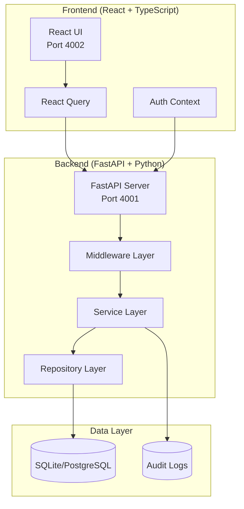
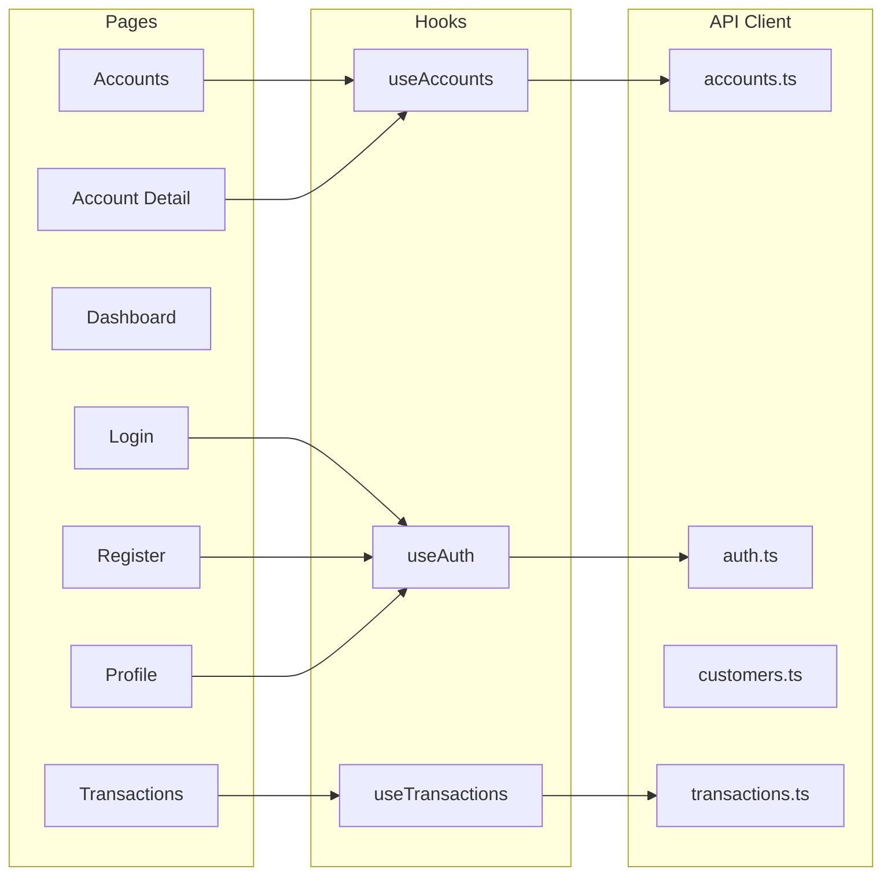
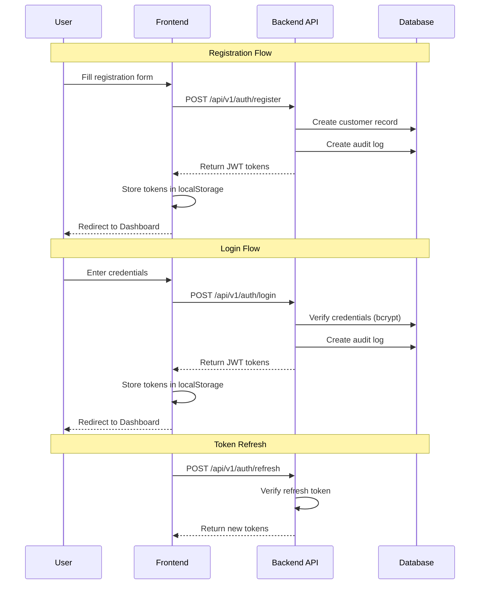
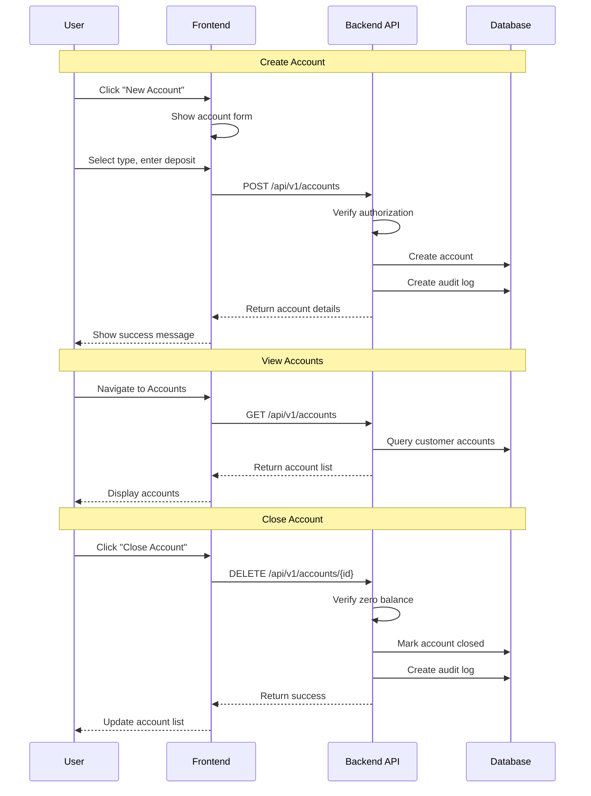
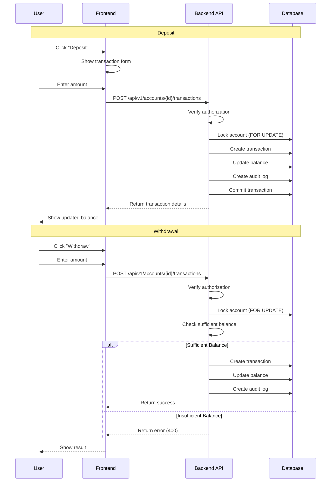
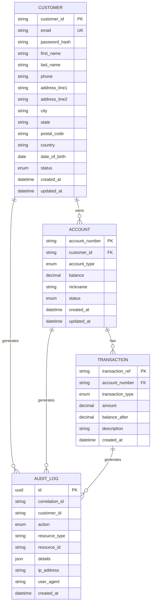
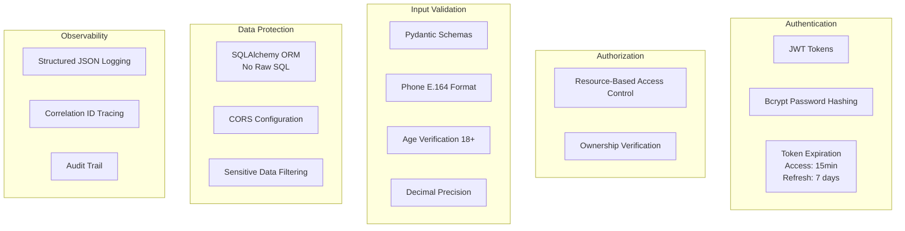
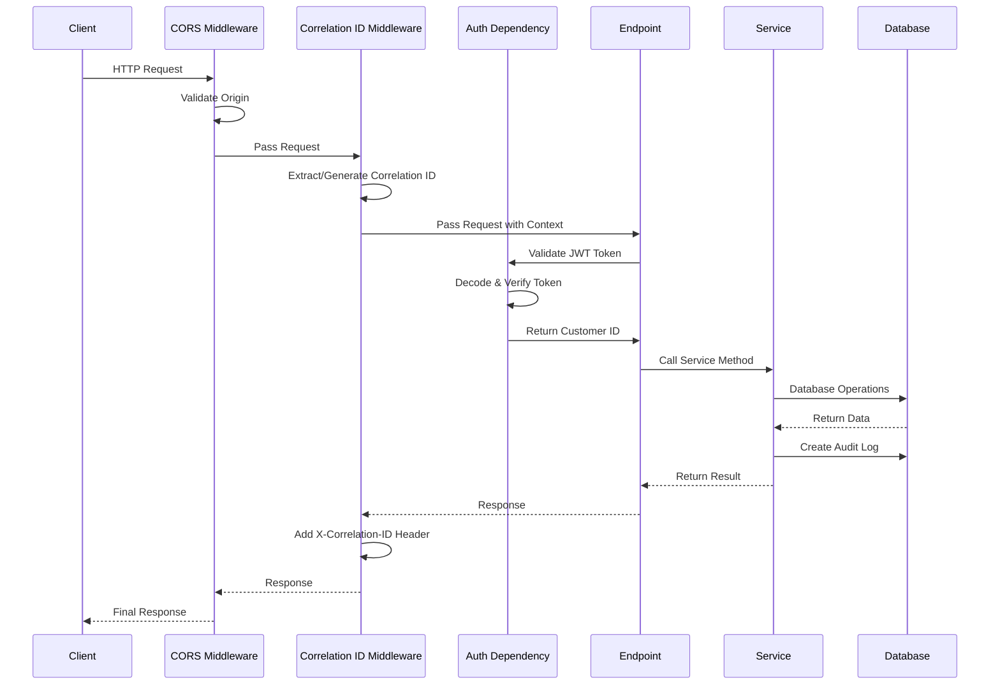

# Banking Microservices Application

A full-stack banking application with CRUD operations for customers, accounts, and transactions.

## Quick Start

```bash
# Start both backend and frontend
./start.sh

# Stop all services
./stop.sh
```

**Services:**
- Backend API: http://localhost:4001
- API Documentation: http://localhost:4001/docs
- Frontend: http://localhost:4002

---

## Architecture Overview



---

## System Components

### Frontend Architecture



### Backend Architecture

```mermaid
graph TB
    subgraph "API Layer (/api/v1)"
        AUTH_EP[/auth]
        ACCT_EP[/accounts]
        CUST_EP[/customers]
        TXN_EP[/transactions]
        HEALTH_EP[/health]
    end

    subgraph "Service Layer"
        CS[CustomerService]
        AS[AccountService]
        TS[TransactionService]
    end

    subgraph "Models"
        CM[Customer]
        AM[Account]
        TM[Transaction]
        AL[AuditLog]
    end

    AUTH_EP --> CS
    ACCT_EP --> AS
    CUST_EP --> CS
    TXN_EP --> TS

    CS --> CM
    CS --> AL
    AS --> AM
    AS --> AL
    TS --> TM
    TS --> AL
```

---

## Authentication Flow



---

## Account Management Flow



---

## Transaction Flow



---

## Data Model



---

## API Endpoints

### Authentication

| Method | Endpoint | Description |
|--------|----------|-------------|
| POST | `/api/v1/auth/register` | Register new customer |
| POST | `/api/v1/auth/login` | Login and get tokens |
| POST | `/api/v1/auth/refresh` | Refresh access token |

### Customers

| Method | Endpoint | Description |
|--------|----------|-------------|
| GET | `/api/v1/customers/me` | Get current customer profile |
| PUT | `/api/v1/customers/me` | Update customer profile |
| DELETE | `/api/v1/customers/me` | Deactivate customer account |

### Accounts

| Method | Endpoint | Description |
|--------|----------|-------------|
| GET | `/api/v1/accounts` | List customer accounts |
| POST | `/api/v1/accounts` | Create new account |
| GET | `/api/v1/accounts/{number}` | Get account details |
| PUT | `/api/v1/accounts/{number}` | Update account settings |
| DELETE | `/api/v1/accounts/{number}` | Close account |

### Transactions

| Method | Endpoint | Description |
|--------|----------|-------------|
| GET | `/api/v1/accounts/{number}/transactions` | List transactions |
| POST | `/api/v1/accounts/{number}/transactions` | Create transaction |
| GET | `/api/v1/accounts/{number}/transactions/{ref}` | Get transaction details |

### Health

| Method | Endpoint | Description |
|--------|----------|-------------|
| GET | `/api/v1/health` | Liveness check |
| GET | `/api/v1/health/ready` | Readiness check |

---

## Security Features



---

## Request Flow with Middleware



---

## Project Structure

```
banking_microservice/
├── backend/
│   ├── app/
│   │   ├── api/
│   │   │   ├── deps.py           # Dependencies (auth, db)
│   │   │   └── v1/
│   │   │       ├── router.py     # API router
│   │   │       ├── auth.py       # Auth endpoints
│   │   │       ├── accounts.py   # Account endpoints
│   │   │       ├── customers.py  # Customer endpoints
│   │   │       ├── transactions.py
│   │   │       └── health.py
│   │   ├── core/
│   │   │   ├── exceptions.py     # Custom exceptions
│   │   │   ├── logging.py        # Structured logging
│   │   │   └── security.py       # JWT & password utils
│   │   ├── models/
│   │   │   ├── customer.py
│   │   │   ├── account.py
│   │   │   ├── transaction.py
│   │   │   └── audit_log.py
│   │   ├── schemas/
│   │   │   ├── customer.py       # Pydantic schemas
│   │   │   ├── account.py
│   │   │   ├── transaction.py
│   │   │   └── auth.py
│   │   ├── services/
│   │   │   ├── customer_service.py
│   │   │   ├── account_service.py
│   │   │   └── transaction_service.py
│   │   ├── config.py             # Settings
│   │   ├── database.py           # DB connection
│   │   └── main.py               # FastAPI app
│   └── requirements.txt
├── frontend/
│   ├── src/
│   │   ├── api/                  # API clients
│   │   ├── components/           # UI components
│   │   ├── hooks/                # React hooks
│   │   ├── pages/                # Page components
│   │   ├── types/                # TypeScript types
│   │   └── App.tsx
│   ├── package.json
│   └── vite.config.ts
├── specs/                        # Feature specifications
├── start.sh                      # Start script
├── stop.sh                       # Stop script
├── docker-compose.yml            # Docker config
├── CONSTITUTION_COMPLIANCE.md    # Security compliance
└── README.md                     # This file
```

---

## Technology Stack

### Backend
- **Framework**: FastAPI (Python 3.11+)
- **ORM**: SQLAlchemy 2.0 (async)
- **Database**: SQLite (dev) / PostgreSQL 15+ (prod)
- **Authentication**: JWT (python-jose)
- **Password Hashing**: bcrypt via passlib
- **Validation**: Pydantic v2

### Frontend
- **Framework**: React 18 with TypeScript
- **Build Tool**: Vite
- **Styling**: TailwindCSS
- **State Management**: React Query
- **Routing**: React Router v6
- **HTTP Client**: Axios

---

## Configuration

### Environment Variables

| Variable | Default | Description |
|----------|---------|-------------|
| `DATABASE_URL` | `sqlite+aiosqlite:///./banking.db` | Database connection string |
| `USE_SQLITE` | `true` | Use SQLite instead of PostgreSQL |
| `SECRET_KEY` | (required in prod) | JWT signing key |
| `ACCESS_TOKEN_EXPIRE_MINUTES` | `15` | Access token TTL |
| `REFRESH_TOKEN_EXPIRE_DAYS` | `7` | Refresh token TTL |
| `CORS_ORIGINS` | `localhost:3000,4002,5173` | Allowed CORS origins |
| `LOG_LEVEL` | `INFO` | Logging level |

---

## Development

### Prerequisites
- Python 3.11+
- Node.js 18+
- npm or yarn

### Running Locally

```bash
# Start both services
./start.sh

# Or run separately:

# Backend
cd backend
python -m venv venv
source venv/bin/activate
pip install -r requirements.txt
uvicorn app.main:app --reload --port 4001

# Frontend
cd frontend
npm install
npm run dev -- --port 4002
```

### Running with Docker

```bash
# Start PostgreSQL only
docker compose up -d postgres

# Start all services
docker compose up -d
```

---

## Related Documentation

- [Constitution Compliance](CONSTITUTION_COMPLIANCE.md) - Security implementation details
- [API Documentation](http://localhost:4001/docs) - Interactive Swagger UI
- [Feature Specifications](specs/) - Detailed feature specs

---

## License

Private - All rights reserved.
